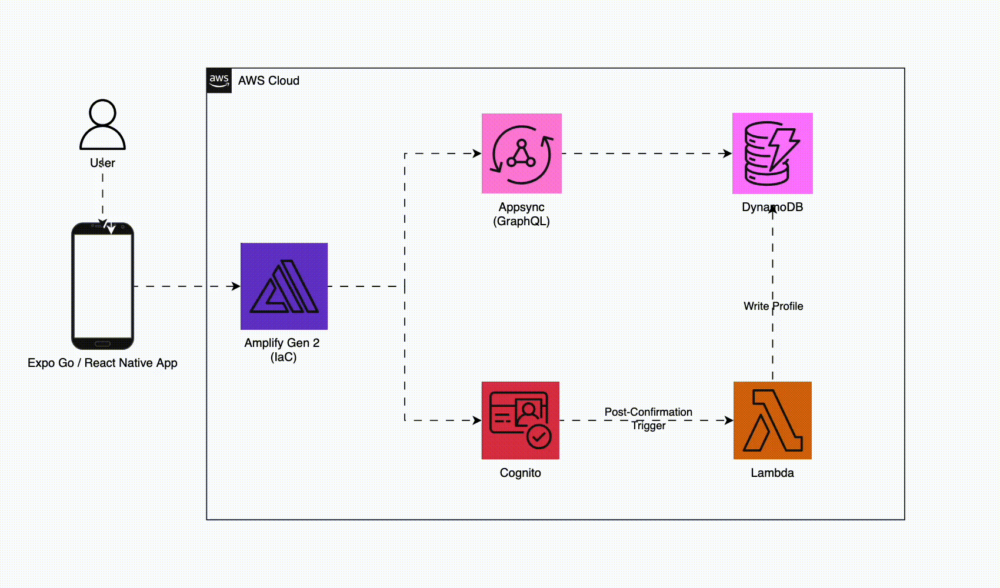

# Seamless Auth in Expo Go: Powered by AWS Amplify Gen 2

A React Native mobile app with email authentication, built with Expo and AWS Amplify Gen 2. 👾

## Features

- Email/password sign up with OTP verification
- User sign in and sign out
- Session persistence
- Works in Expo Go

**Tech Stack**:
- **Frontend**: React Native + Expo + TypeScript
- **Auth**: AWS Cognito (USER_PASSWORD_AUTH for Expo Go)
- **API**: AWS AppSync GraphQL
- **Database**: Amazon DynamoDB
- **Backend**: AWS Amplify Gen 2 (Infrastructure as Code)

## 🏗️ Architecture



### How It Works

**Authentication Flow**:
- User signs up → Cognito creates account
- Email verification via OTP
- Post-confirmation Lambda triggers
- Profile auto-created in DynamoDB

**Data Flow**:
- Frontend → Amplify SDK → AppSync GraphQL → DynamoDB
- Real-time sync via AppSync subscriptions
- Authorization via Cognito User Pools


## 🚀 Quick Start

```bash
# Install dependencies
npm install

# Start Amplify backend 
npx ampx sandbox --profile <your-aws-profile>

# Start Expo 
npx expo start

# Scan QR code with Expo Go app
```

## 📁 Project Structure

```
expo-amplify/
├── app/(app)/home.tsx           # Expo Router app directory
├── app/(auth)                   # Auth routes
├── app/(auth)/sign-in.tsx       # Sign in page
├── app/(auth)/sign-up.tsx       # Sign up page
├── index.ts             
├── amplify/
│   ├── auth/resource.ts    # Cognito configuration
│   ├── auth/post-confirmation/handler.ts  
│   ├── auth/post-confirmation/resource.ts 
│   └── data/resource.ts    # GraphQL schema
│   └── backend.ts          # Backend configuration
└── amplify_outputs.json    # Auto-generated config
```

> **For production**: Use a native build with `USER_SRP_AUTH` for better security.

## View Your Resources

```bash
# User Pool ID
cat amplify_outputs.json | grep user_pool_id

# API Endpoint
cat amplify_outputs.json | grep '"url"'
```

**AWS Console**:
- **Users**: Cognito → User Pools → Your pool → Users tab
- **API**: AppSync → APIs → Your API
- **Storage**: DynamoDB → Tables → Your table

## Documentation

- **Detailed Guide**: See `DEVELOPER_GUIDE.md` for comprehensive documentation


## 📖 Learn More

- [AWS Amplify Docs](https://docs.amplify.aws/react-native/)
- [Amplify Auth](https://docs.amplify.aws/react-native/build-a-backend/auth/)
- [Expo Documentation](https://docs.expo.dev/)


**Built with Expo and AWS Amplify Gen 2**
***Demo by Matthew Enarle***
